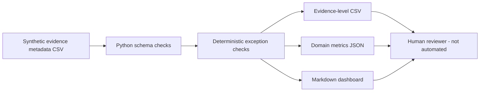

# Architecture

```mermaid
flowchart LR
 A[Synthetic evidence metadata CSV] --> B[Python schema checks]
 B --> C[Deterministic exception checks]
 C --> D[Evidence-level CSV]
 C --> E[Domain metrics JSON]
 C --> F[Markdown dashboard]
 D --> G[Human reviewer - not automated]
 E --> G
 F --> G
```
Offline simulation. No APIs, network connections, secrets, databases or privileged production permissions are needed. All example evidence references use SIM://.
